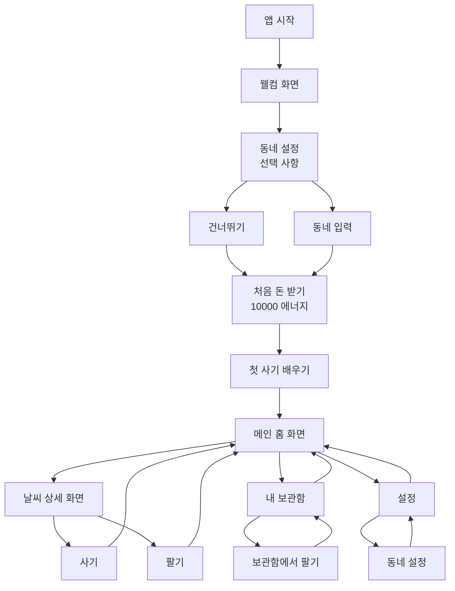
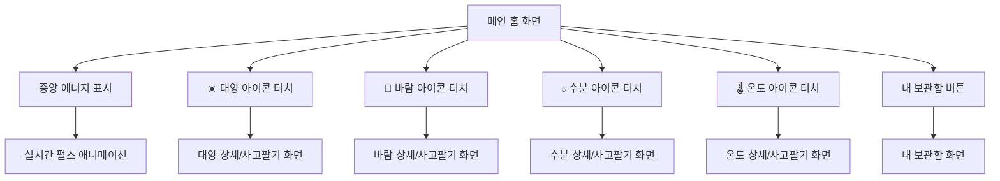
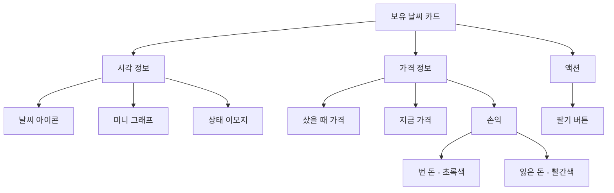
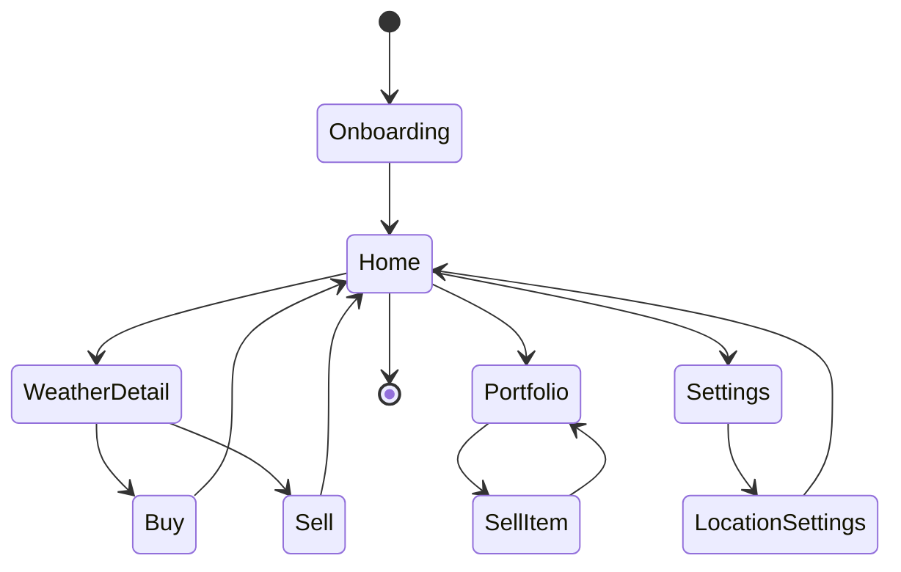

# 날씨 경제 교육 앱 와이어프레임

> 초등학교 고학년(10-12세) 대상 날씨 기반 경제 교육 앱 모바일 와이어프레임

## 목차

1. [디자인 원칙](#디자인-원칙)
2. [화면 흐름도](#화면-흐름도)
3. [온보딩/튜토리얼 화면](#1-온보딩튜토리얼-화면)
4. [메인 홈 화면](#2-메인-홈-화면)
5. [날씨 상세/사고팔기 화면](#3-날씨-상세사고팔기-화면)
6. [내 보관함 화면](#4-내-보관함-화면)
7. [동네 설정 화면](#5-동네-설정-화면)

---

## 디자인 원칙

### 색상 시스템
아이들이 한눈에 알아볼 수 있도록 색깔과 이모지를 활용합니다.

- 🔥 **빨간 배경** = 가격이 올라가는 중!
- ❄️ **파란 배경** = 가격이 내려가는 중
- ⚪ **회색 배경** = 변화 없음

### 화살표로 변화 강도 표시
- `↗↗` 많이 올랐어요!
- `↗` 조금 올랐어요
- `→` 그대로예요
- `↘` 조금 내렸어요
- `↘↘` 많이 내렸어요!

### 쉬운 말 사용
- ❌ "매수/매도" → ✅ "사기/팔기"
- ❌ "수익률" → ✅ "얼마나 벌었는지"
- ❌ "손익" → ✅ "번 돈/잃은 돈"
- ❌ "자산" → ✅ "가진 것들"
- ❌ "거래" → ✅ "사고 팔기"

### 터치 친화적
- 큰 버튼 (최소 44x44px)
- 넉넉한 간격
- 즉각적인 반응

---

## 화면 흐름도



---

## 1. 온보딩/튜토리얼 화면

### 1.1 웰컴 화면

```
┌─────────────────────────────────┐
│                                 │
│         🌤️ 날씨 에너지          │
│                                 │
│     날씨를 사고 팔면서          │
│     경제를 배워요!              │
│                                 │
│         [일러스트]              │
│    태양☀️ 바람💨 물💧 온도🌡️   │
│                                 │
│                                 │
│   3분마다 가격이 바뀌어요      │
│   계절에 맞는 날씨로 게임해요   │
│                                 │
│                                 │
│   ┌─────────────────────┐      │
│   │   시작하기 →        │      │
│   └─────────────────────┘      │
│                                 │
└─────────────────────────────────┘
```

**화면 요소:**
- 앱 로고 및 이름
- 간단한 서비스 설명 (1-2줄)
- 4가지 날씨 아이콘 미리보기
- 큰 시작 버튼

---

### 1.2 동네 설정 (선택 화면)

```
┌─────────────────────────────────┐
│  ← 뒤로                    1/3  │
├─────────────────────────────────┤
│                                 │
│          📍                     │
│                                 │
│    어디 사니? (선택)            │
│                                 │
│   동네 이름을 알려주면          │
│   더 재미있어요!                │
│                                 │
│   (실제 날씨랑은 상관없어요)    │
│                                 │
│   ┌─────────────────────┐      │
│   │ 서울                │      │
│   └─────────────────────┘      │
│                                 │
│      예시: 서울, 부산, 제주     │
│                                 │
│                                 │
│   ┌─────────────────────┐      │
│   │   다음에 하기       │      │
│   └─────────────────────┘      │
│                                 │
│   ┌─────────────────────┐      │
│   │   확인 →            │      │
│   └─────────────────────┘      │
│                                 │
└─────────────────────────────────┘
```

**화면 요소:**
- 진행 단계 표시 (1/3)
- 텍스트 입력 필드
- 설명 문구 (실제 날씨와 무관)
- "다음에 하기" 버튼 (회색, 보조)
- "확인" 버튼 (메인, 강조)

---

### 1.3 처음 주는 돈

```
┌─────────────────────────────────┐
│                          2/3    │
├─────────────────────────────────┤
│                                 │
│           💰                    │
│                                 │
│      처음 주는 돈               │
│                                 │
│      10,000 에너지              │
│                                 │
│                                 │
│   [동전 떨어지는 애니메이션]    │
│                                 │
│                                 │
│   이 돈으로 날씨를 사고 팔아요  │
│   많이 벌어보세요!              │
│                                 │
│                                 │
│   ┌─────────────────────┐      │
│   │   좋아요! →         │      │
│   └─────────────────────┘      │
│                                 │
└─────────────────────────────────┘
```

**화면 요소:**
- 큰 금액 표시 (10,000 에너지)
- 애니메이션 (선택 사항)
- 간단한 설명
- 다음 버튼

---

### 1.4 첫 사기 배우기

```
┌─────────────────────────────────┐
│                          3/3    │
├─────────────────────────────────┤
│                                 │
│      첫 날씨 사는 법            │
│                                 │
│  ┌─────────────────────────┐   │
│  │ 태양☀️  Solar           │   │
│  │                         │   │
│  │  [작은 그래프]   🔥     │   │
│  │                         │   │
│  │  1,200 에너지   ↗ +5%  │   │
│  └─────────────────────────┘   │
│         ↓ 이걸 눌러봐!          │
│                                 │
│  지금 12월 겨울이야!            │
│  낮이 되면 태양 에너지가        │
│  올라갈 거야 🌞                 │
│                                 │
│  한번 사볼까?                   │
│                                 │
│                                 │
│   ┌─────────────────────┐      │
│   │   사러 가기 →       │      │
│   └─────────────────────┘      │
│                                 │
│   ┌─────────────────────┐      │
│   │   나중에 하기       │      │
│   └─────────────────────┘      │
│                                 │
└─────────────────────────────────┘
```

**화면 요소:**
- 예시 날씨 카드 (강조 표시)
- 화살표 또는 하이라이트
- 쉬운 설명 (계절 연관)
- 행동 유도 버튼
- 건너뛰기 옵션

---

## 2. 메인 홈 화면

### 2.1 전체 레이아웃 (원형 디자인)

```
┌─────────────────────────────────┐
│  ☰ 메뉴            📍서울    👤 │
├─────────────────────────────────┤
│                                 │
│           ☀️                    │
│      (터치 가능)                │
│                                 │
│                                 │
│                                 │
│  💨              💎             │
│                                 │
│            12,350               │
│         ═══════════             │
│          내 에너지              │
│                                 │
│    🟢 +2,350 (+23.5%)          │
│     [펄스 애니메이션]           │
│                          🌡️    │
│                                 │
│                                 │
│                                 │
│           💧                    │
│      (터치 가능)                │
│                                 │
├─────────────────────────────────┤
│                                 │
│  🗓️ 12월 겨울 오후 3시          │
│  💡 태양 에너지 약해지는 중!    │
│                                 │
│  3분마다 자동으로 바뀌어요     │
│                                 │
├─────────────────────────────────┤
│                                 │
│  ┌────────────────────────┐    │
│  │   내 보관함 보기 →     │    │
│  └────────────────────────┘    │
│                                 │
└─────────────────────────────────┘
```

**화면 구조:**

1. **상단 바**
   - 햄버거 메뉴 (왼쪽)
   - 동네 표시 (중앙)
   - 프로필 아이콘 (오른쪽)

2. **중앙 원형 레이아웃 (핵심!)**
   - 🎯 **중심**: 총 에너지 크게 표시
     - 큰 숫자 (12,350)
     - "내 에너지" 라벨
     - 변화량 (+2,350) 및 변화율 (+23.5%)
     - 🟢 초록색 펄스 (올라갈 때) / 🔴 빨간색 펄스 (내려갈 때)
   
   - 🔄 **원형 배치**: 4가지 날씨 아이콘이 중심을 둘러쌈
     - ☀️ 태양 (위쪽 12시 방향)
     - 💨 바람 (왼쪽 9시 방향)
     - 💧 수분 (아래 6시 방향)
     - 🌡️ 온도 (오른쪽 3시 방향)
     - 각 아이콘은 터치 가능 (살짝 큰 사이즈, 터치 영역 넉넉)
     - 상태에 따라 아이콘 주변에 색깔 링 (빨강/파랑/회색)

3. **계절 정보 바**
   - 현재 월/계절/시간
   - 간단한 힌트 메시지
   - 업데이트 주기 안내

4. **하단 버튼**
   - 내 보관함 보기 (큰 버튼)

---

### 2.2 중앙 에너지 표시 상세

```
        총 에너지가 올라갈 때:
        
     ┌─────────────────┐
     │                 │
     │   💎 12,350     │  <- 큰 숫자
     │  ═══════════    │
     │   내 에너지     │
     │                 │
     │ 🟢 +2,350       │  <- 초록색
     │   (+23.5%) ↗    │
     │                 │
     │ [◉ ◯ ◯] 펄스   │  <- 초록 펄스 애니메이션
     │                 │
     └─────────────────┘
```

```
        총 에너지가 내려갈 때:
        
     ┌─────────────────┐
     │                 │
     │   💎 9,200      │  <- 큰 숫자
     │  ═══════════    │
     │   내 에너지     │
     │                 │
     │ 🔴 -800         │  <- 빨간색
     │   (-8.0%) ↘     │
     │                 │
     │ [◉ ◯ ◯] 펄스   │  <- 빨간 펄스 애니메이션
     │                 │
     └─────────────────┘
```

---

### 2.3 날씨 아이콘 원형 배치 상세

```
                 ☀️
               (태양)
            상승 중: 빨간 링
            
                 │
                 │
    💨 ─────── 💎 ─────── 🌡️
   (바람)    (중심)      (온도)
  변화 없음   12,350    상승 중
   회색 링    에너지    빨간 링
   
                 │
                 │
                 
                💧
              (수분)
            하락 중: 파란 링
```

**아이콘 스펙:**
- 크기: 60x60px (터치하기 편하게)
- 터치 영역: 80x80px (넉넉한 패딩)
- 상태 링: 아이콘 주변 원형 테두리 (3px)
  - 🔥 상승: 빨간색 링
  - ❄️ 하락: 파란색 링
  - ⚪ 안정: 회색 링
- 터치 시: 약간 커지는 애니메이션 + 상세 화면으로 이동

---

### 2.4 인터랙션 플로우



---

### 2.5 애니메이션 동작

**1. 총 에너지 실시간 업데이트 (3분마다)**
```
변화 전:  💎 12,000
         ↓ (페이드 + 카운팅 애니메이션)
변화 후:  💎 12,350
         + 초록색 펄스 확산 효과
         + "+350" 텍스트가 위로 떠오르며 사라짐
```

**2. 날씨 아이콘 상태 변화**
```
상태 변경 시:
- 링 색깔이 부드럽게 변함
- 아이콘이 살짝 튕기는 효과
- 진동 피드백 (선택)
```

**3. 아이콘 터치 시**
```
터치:    ☀️  (60x60)
         ↓
확대:    ☀️  (70x70) - 0.1초
         ↓
화면전환: 상세 화면으로 슬라이드
```

---

### 2.6 날씨 아이콘 상태 표시

**아이콘 + 상태 링 조합:**

| 상태 | 아이콘 | 링 색상 | 애니메이션 | 변화율 |
|------|--------|---------|-----------|--------|
| 많이 올라감 | ☀️💨💧🌡️ | 🔴 진한 빨강 | 빠른 펄스 | +5% 이상 |
| 올라감 | ☀️💨💧🌡️ | 🟠 빨강 | 천천히 펄스 | +1% ~ +5% |
| 변화 없음 | ☀️💨💧🌡️ | ⚪ 회색 | 없음 | -1% ~ +1% |
| 내려감 | ☀️💨💧🌡️ | 🔵 파랑 | 천천히 펄스 | -5% ~ -1% |
| 많이 내려감 | ☀️💨💧🌡️ | 🔵 진한 파랑 | 빠른 펄스 | -5% 이하 |

**링 디자인:**
```
    많이 올라감:              변화 없음:
    
      ◉◉◉                      ○○○
     ◉☀️◉                    ○☀️○
      ◉◉◉                      ○○○
    (빨간 펄스)              (회색 정적)
```

---

## 3. 날씨 상세/사고팔기 화면

### 3.1 전체 레이아웃

```
┌─────────────────────────────────┐
│  ← 뒤로        태양 ☀️    ⋮ 더보기│
├─────────────────────────────────┤
│                                 │
│         Solar Energy            │
│         ☀️                      │
│                                 │
│      💰 1,200 에너지            │
│      🔥 ↗↗ +8.5% (지금)        │
│                                 │
├─────────────────────────────────┤
│                                 │
│   ┌───────────────────────┐    │
│   │                       │    │
│   │     [24시간 그래프]   │    │
│   │                       │    │
│   │     ▁▂▃▅▇▇█●         │    │
│   │                       │    │
│   │   색깔 영역 채우기    │    │
│   │   (빨간색 그라데이션) │    │
│   │                       │    │
│   │        🔥             │    │
│   │   지금 올라가는 중!   │    │
│   │                       │    │
│   └───────────────────────┘    │
│                                 │
│   어제  12시  오후6  지금        │
│                                 │
├─────────────────────────────────┤
│                                 │
│  🗓️ 지금 계절                   │
│  ┌──────────────────────────┐  │
│  │ 12월 겨울 ❄️            │  │
│  │                          │  │
│  │ 겨울에는 태양이 약해요   │  │
│  │ 하지만 낮에는 올라가요!  │  │
│  └──────────────────────────┘  │
│                                 │
│  💡 도움말                      │
│  ┌──────────────────────────┐  │
│  │ 곧 해가 지면 가격이      │  │
│  │ 떨어질 거예요!           │  │
│  └──────────────────────────┘  │
│                                 │
├─────────────────────────────────┤
│                                 │
│  ┌─────────┐  ┌─────────┐     │
│  │  사기   │  │  팔기   │     │
│  └─────────┘  └─────────┘     │
│     (선택됨)      (비활성)      │
│                                 │
│  얼마나 살까요?                 │
│  ┌──────────────────────────┐  │
│  │  2,000 에너지            │  │
│  └──────────────────────────┘  │
│     [─────●──────────]         │
│       0      5,000    10,000   │
│                                 │
│  사고 나면?                     │
│  ┌──────────────────────────┐  │
│  │ 날씨 1개 살 수 있어요    │  │
│  │                          │  │
│  │ 남은 에너지: 6,450       │  │
│  └──────────────────────────┘  │
│                                 │
│  ┌─────────────────────┐       │
│  │   확인! 사기 →      │       │
│  └─────────────────────┘       │
│                                 │
└─────────────────────────────────┘
```

**화면 구조:**

1. **헤더**
   - 뒤로 가기
   - 날씨 이름
   - 더보기 메뉴

2. **가격 정보**
   - 큰 가격 표시
   - 현재 상태 (화살표 + %)
   - 상태 이모지

3. **24시간 그래프**
   - 영역 채워진 라인 차트
   - 배경색 (상승: 빨강 그라데이션, 하락: 파랑 그라데이션)
   - 엔드포인트 표시 (●)
   - 펄스 애니메이션
   - 큰 이모지 + 상태 메시지
   - 시간 라벨 (어제, 12시, 오후6, 지금)

4. **계절 정보 카드**
   - 현재 계절 표시
   - 계절별 특징 설명
   - 색상 구분

5. **도움말 카드**
   - 패턴 힌트
   - 타이밍 조언

6. **사고팔기 인터페이스**
   - 탭 (사기/팔기)
   - 금액 입력 필드
   - 슬라이더
   - 예상 결과 미리보기
   - 확인 버튼 (크고 명확)

---

### 3.2 그래프 상태별 디자인

**올라가는 중 (빨간 배경)**
```
   ┌───────────────────────┐
   │                       │
   │    ▁▂▃▅▇▇█●          │
   │   /▓▓▓▓▓▓▓▓          │
   │  /▓▓▓▓▓▓▓▓▓          │ <- 빨간 그라데이션
   │ /▓▓▓▓▓▓▓▓▓▓          │
   │/▓▓▓▓▓▓▓▓▓▓▓          │
   │───────────────────────│
   │                       │
   │        🔥             │
   │   지금 올라가는 중!   │
   │                       │
   └───────────────────────┘
```

**내려가는 중 (파란 배경)**
```
   ┌───────────────────────┐
   │                       │
   │ █▇▅▃▂▁▁▁●            │
   │ ▓▓▓▓▓▓\               │
   │ ▓▓▓▓▓▓▓\              │ <- 파란 그라데이션
   │ ▓▓▓▓▓▓▓▓\             │
   │ ▓▓▓▓▓▓▓▓▓\            │
   │───────────────────────│
   │                       │
   │        ❄️             │
   │     내려가는 중       │
   │                       │
   └───────────────────────┘
```

---

### 3.3 사기 vs 팔기 인터페이스

**사기 모드:**
```
┌──────────────────────────────┐
│ [사기 탭 - 활성] [팔기 탭]  │
├──────────────────────────────┤
│                              │
│ 얼마나 살까요?               │
│ ┌────────────────────────┐  │
│ │ 2,000 에너지           │  │
│ └────────────────────────┘  │
│   [─────●──────────]        │
│                              │
│ 사고 나면?                   │
│ • 날씨 1개 살 수 있어요      │
│ • 남은 에너지: 6,450         │
│                              │
│ ┌────────────────────────┐  │
│ │   확인! 사기 →         │  │
│ └────────────────────────┘  │
└──────────────────────────────┘
```

**팔기 모드:**
```
┌──────────────────────────────┐
│ [사기 탭] [팔기 탭 - 활성]  │
├──────────────────────────────┤
│                              │
│ 가지고 있는 것: 3개          │
│                              │
│ 얼마나 팔까요?               │
│ ┌────────────────────────┐  │
│ │ 2개                    │  │
│ └────────────────────────┘  │
│   [──●──────]    전부 팔기  │
│                              │
│ 팔고 나면?                   │
│ • 2,400 에너지 받아요        │
│ • 번 돈: +400 🟢            │
│ • 남는 날씨: 1개             │
│                              │
│ ┌────────────────────────┐  │
│ │   확인! 팔기 →         │  │
│ └────────────────────────┘  │
└──────────────────────────────┘
```

---

## 4. 내 보관함 화면

### 4.1 전체 레이아웃

```
┌─────────────────────────────────┐
│  ← 뒤로      내 보관함      ⚙️  │
├─────────────────────────────────┤
│                                 │
│  내가 가진 전부                 │
│  💎 12,350 에너지               │
│                                 │
│  얼마나 벌었는지                │
│  🟢 +2,350 (+23.5%)            │
│  ─────────────────────────     │
│            잘했어요! 🎉         │
│                                 │
│  ┌───────────────────────┐     │
│  │  [선 그래프]          │     │
│  │    ╱                  │     │
│  │   ╱                   │     │
│  │  ╱                    │     │
│  │ ╱                     │     │
│  │─────────────────────  │     │
│  │ 어제  오전  오후  지금 │     │
│  └───────────────────────┘     │
│                                 │
├─────────────────────────────────┤
│                                 │
│  가지고 있는 날씨               │
│                                 │
│  ┌──────────────────────────┐  │
│  │ ☀️ 태양 3개          🔥│  │
│  │ [▁▃▅▇█] 작은 그래프     │  │
│  │                          │  │
│  │ 샀을 때: 1,100 ⚡        │  │
│  │ 지금: 1,200 ⚡           │  │
│  │ 🟢 번 돈: +300 (+9%)    │  │
│  │                          │  │
│  │      ┌──────────┐        │  │
│  │      │  팔기    │        │  │
│  │      └──────────┘        │  │
│  └──────────────────────────┘  │
│                                 │
│  ┌──────────────────────────┐  │
│  │ 💧 수분 5개          ❄️│  │
│  │ [▇▅▃▁▁] 작은 그래프     │  │
│  │                          │  │
│  │ 샀을 때: 1,100 ⚡        │  │
│  │ 지금: 1,050 ⚡           │  │
│  │ 🔴 잃은 돈: -250 (-5%)  │  │
│  │                          │  │
│  │      ┌──────────┐        │  │
│  │      │  팔기    │        │  │
│  │      └──────────┘        │  │
│  └──────────────────────────┘  │
│                                 │
│  ┌──────────────────────────┐  │
│  │ 🌡️ 온도 2개          🔥│  │
│  │ [▁▃▃▅▇] 작은 그래프     │  │
│  │                          │  │
│  │ 샀을 때: 750 ⚡          │  │
│  │ 지금: 780 ⚡             │  │
│  │ 🟢 번 돈: +60 (+4%)     │  │
│  │                          │  │
│  │      ┌──────────┐        │  │
│  │      │  팔기    │        │  │
│  │      └──────────┘        │  │
│  └──────────────────────────┘  │
│                                 │
├─────────────────────────────────┤
│                                 │
│  날씨별로 얼마나 가지고 있는지  │
│                                 │
│  ┌──────────────────────────┐  │
│  │ ☀️ 태양  ████ 30%       │  │
│  │ 💧 수분  ████████ 50%   │  │
│  │ 🌡️ 온도  ████ 20%       │  │
│  │ 💨 바람  (없음)          │  │
│  └──────────────────────────┘  │
│                                 │
├─────────────────────────────────┤
│                                 │
│  사고 판 기록                   │
│                                 │
│  ┌──────────────────────────┐  │
│  │ ☀️ 태양 1개 샀어요       │  │
│  │ 1,200 ⚡                 │  │
│  │ 5분 전                   │  │
│  └──────────────────────────┘  │
│                                 │
│  ┌──────────────────────────┐  │
│  │ 💨 바람 2개 팔았어요     │  │
│  │ 1,780 ⚡  🟢 +80        │  │
│  │ 1시간 전                 │  │
│  └──────────────────────────┘  │
│                                 │
│  ┌──────────────────────────┐  │
│  │ 💧 수분 3개 샀어요       │  │
│  │ 3,150 ⚡                 │  │
│  │ 2시간 전                 │  │
│  └──────────────────────────┘  │
│                                 │
│         더 보기 ↓               │
│                                 │
└─────────────────────────────────┘
```

**화면 구조:**

1. **헤더**
   - 뒤로 가기
   - 제목
   - 설정 아이콘

2. **요약 정보**
   - 내가 가진 전부 (총 가치)
   - 얼마나 벌었는지 (금액, %, 색깔)
   - 격려 메시지
   - 변화 그래프 (선 그래프)

3. **가지고 있는 날씨 목록**
   - 날씨별 카드
     - 날씨 이름 + 개수
     - 작은 그래프 + 상태 이모지
     - 샀을 때 가격
     - 지금 가격
     - 번 돈/잃은 돈 (색깔 구분)
     - 팔기 버튼

4. **날씨별 구성**
   - 바 차트
   - 각 날씨별 비율

5. **사고 판 기록**
   - 시간순 목록
   - 각 거래: 날씨, 행동, 금액, 손익, 시간

---

### 4.2 보유 날씨 카드 상세



---

### 4.3 총 재산 변화 그래프

```
   ┌───────────────────────────┐
   │  내 전체 변화             │
   ├───────────────────────────┤
   │                           │
   │  12,350                   │
   │      ╱●                   │  <- 초록색 선 (이익)
   │     ╱                     │
   │    ╱                      │
   │   ╱                       │
   │  ●                        │
   │ 10,000 (시작)             │
   │───────────────────────────│
   │ 어제   오전   오후   지금 │
   └───────────────────────────┘
```

**손해 보는 경우:**
```
   ┌───────────────────────────┐
   │  내 전체 변화             │
   ├───────────────────────────┤
   │  10,000 (시작)            │
   │  ●                        │
   │   \                       │
   │    \                      │
   │     \                     │  <- 빨간색 선 (손해)
   │      \●                   │
   │  8,750                    │
   │───────────────────────────│
   │ 어제   오전   오후   지금 │
   └───────────────────────────┘
```

---

## 5. 동네 설정 화면

### 5.1 처음 설정

```
┌─────────────────────────────────┐
│  ← 뒤로      동네 설정          │
├─────────────────────────────────┤
│                                 │
│          📍                     │
│                                 │
│    어디서 게임할래?             │
│                                 │
│   ┌─────────────────────┐      │
│   │ 서울                │      │
│   └─────────────────────┘      │
│                                 │
│   💡 알아두기                   │
│   • 게임용 이름이에요           │
│   • 실제 날씨랑 상관없어요      │
│   • 안 써도 게임할 수 있어요    │
│                                 │
│                                 │
│   ┌─────────────────────┐      │
│   │   나중에 할래       │      │
│   └─────────────────────┘      │
│                                 │
│   ┌─────────────────────┐      │
│   │   확인 →            │      │
│   └─────────────────────┘      │
│                                 │
└─────────────────────────────────┘
```

---

### 5.2 설정 완료 화면

```
┌─────────────────────────────────┐
│  ← 뒤로      동네 설정          │
├─────────────────────────────────┤
│                                 │
│          ✅                     │
│                                 │
│    설정 완료!                   │
│                                 │
│  ┌──────────────────────────┐  │
│  │  📍 서울                 │  │
│  │                          │  │
│  │  서울의 계절 날씨로      │  │
│  │  게임 중!                │  │
│  │                          │  │
│  │  🗓️ 지금은 12월 겨울     │  │
│  │                          │  │
│  │  • 추워요 🥶            │  │
│  │  • 건조해요              │  │
│  │  • 태양 약해요           │  │
│  │                          │  │
│  └──────────────────────────┘  │
│                                 │
│                                 │
│   ┌─────────────────────┐      │
│   │   바꾸기            │      │
│   └─────────────────────┘      │
│                                 │
│   ┌─────────────────────┐      │
│   │   게임 시작! →      │      │
│   └─────────────────────┘      │
│                                 │
└─────────────────────────────────┘
```

**화면 요소:**
- 현재 설정된 동네
- 계절 정보
- 현재 계절 특징
- 바꾸기 버튼
- 게임 시작 버튼

---

## 6. 공통 컴포넌트

### 6.1 날씨 상태 이모지 매핑

| 상태 | 이모지 | 배경색 | 설명 |
|------|--------|--------|------|
| 많이 올라감 | 🔥🔥 | 진한 빨강 | +5% 이상 |
| 올라감 | 🔥 | 빨강 | +1% ~ +5% |
| 변화 없음 | ⚪ | 회색 | -1% ~ +1% |
| 내려감 | ❄️ | 파랑 | -5% ~ -1% |
| 많이 내려감 | ❄️❄️ | 진한 파랑 | -5% 이하 |

---

### 6.2 버튼 스타일

**주요 버튼 (Primary)**
```
┌─────────────────────┐
│   확인! 사기 →      │  <- 큰 글씨, 굵게
└─────────────────────┘     파란색 배경
```

**보조 버튼 (Secondary)**
```
┌─────────────────────┐
│   나중에 하기       │  <- 보통 글씨
└─────────────────────┘     회색 배경
```

**위험 버튼 (Danger)**
```
┌─────────────────────┐
│   전부 팔기         │  <- 보통 글씨
└─────────────────────┘     빨간색 테두리
```

---

### 6.3 그래프 타입

**1. 미니 스파크라인 (카드용)**
```
▁▂▃▅▇█  <- 6-8 포인트
```

**2. 영역 차트 (상세 화면)**
```
    █●
   ▓▓▓
  ▓▓▓▓
 ▓▓▓▓▓
▓▓▓▓▓▓  <- 영역 채우기
```

**3. 선 그래프 (보관함)**
```
     ╱●
    ╱
   ╱
  ●
 ╱      <- 단순 선
```

---

### 6.4 입력 필드

**텍스트 입력**
```
┌─────────────────────┐
│ 서울                │  <- 큰 글씨
└─────────────────────┘     아래 테두리만
```

**숫자 입력 + 슬라이더**
```
┌─────────────────────┐
│ 2,000 에너지        │
└─────────────────────┘

[─────●──────────]
0    5,000    10,000
```

---

## 7. 인터랙션 및 애니메이션

### 7.1 3분 업데이트 애니메이션

```
가격 변할 때:
┌──────────────┐       ┌──────────────┐
│ 1,200 ⚡     │  ───> │ 1,250 ⚡     │
│    🔥        │       │   🔥🔥       │
└──────────────┘       └──────────────┘
   (밝아지는 효과 + 숫자 카운팅)
```

---

### 7.2 버튼 탭 피드백

```
눌렀을 때:
┌─────────────────────┐
│   확인! 사기 →      │  <- 약간 작아짐
└─────────────────────┘     색이 진해짐
```

---

### 7.3 카드 스와이프

```
좌우 스와이프로 빠른 액션:
│                          │
│ ← [날씨 카드]  →         │
│     팔기 / 상세보기      │
│                          │
```

---

### 7.4 그래프 엔드포인트 펄스

```
   ▁▂▃▅▇█●  <- 끝 점이
   ▁▂▃▅▇█◉     깜빡깜빡
   ▁▂▃▅▇█●
```

---

## 8. 색상 팔레트

### 8.1 주요 색상

| 색상 | Hex | 용도 |
|------|-----|------|
| 🔴 빨강 | #FF4444 | 상승, 위험 |
| 🟠 주황 | #FF8844 | 경고 |
| 🟡 노랑 | #FFCC00 | 주의 |
| 🟢 초록 | #44CC44 | 이익, 성공 |
| 🔵 파랑 | #4488FF | 주요 버튼, 하락 |
| ⚪ 회색 | #CCCCCC | 중립, 비활성 |

---

### 8.2 날씨별 색상

| 날씨 | 메인 색상 | 보조 색상 |
|------|-----------|-----------|
| ☀️ 태양 | 노랑 #FFDD44 | 주황 #FF8844 |
| 💨 바람 | 하늘색 #88DDFF | 회색 #BBBBBB |
| 💧 수분 | 파랑 #4488FF | 청록 #44CCCC |
| 🌡️ 온도 | 빨강 #FF4444 | 주황 #FF8844 |

---

## 9. 반응형 고려사항

### 9.1 작은 화면 (iPhone SE)
- 날씨 카드 2열 대신 1열
- 버튼 크기 유지 (최소 44px)
- 스크롤 가능

### 9.2 큰 화면 (iPhone Pro Max)
- 날씨 카드 2x2 그리드
- 여백 증가
- 더 큰 그래프

---

## 10. 접근성

### 10.1 텍스트 크기
- 제목: 24-28pt
- 가격: 20-24pt
- 본문: 16-18pt
- 작은 글씨: 14pt (최소)

### 10.2 색상 대비
- 텍스트와 배경 4.5:1 이상
- 중요 정보는 색상만이 아닌 아이콘/텍스트 병행

### 10.3 터치 영역
- 최소 44x44pt
- 버튼 간 간격 8pt 이상

---

## 부록: 화면 전환 다이어그램



---

## 마무리

이 와이어프레임은 초등학교 고학년 아이들이 쉽게 이해하고 사용할 수 있도록 설계되었습니다.

**핵심 디자인 원칙:**
1. 🎨 **색깔과 이모지**로 직관적 정보 전달
2. 💬 **쉬운 말** 사용 (사기/팔기, 번 돈, 가진 것들)
3. 📱 **큰 버튼**과 터치 친화적 UI
4. 📊 **간단한 그래프**로 시각화
5. 🎯 **즉각적인 피드백**과 애니메이션

이 와이어프레임을 바탕으로 개발과 디자인을 진행할 수 있습니다!
